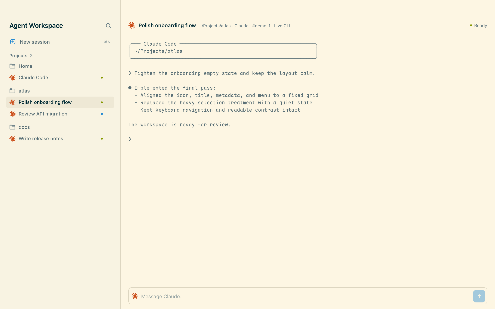

# Agent Workspace

A calm, native macOS workspace for active Claude Code sessions running in tmux.



Agent Workspace is a thin desktop view over Claude Code sessions that keep running in tmux. Search and switch sessions, follow their full CLI-style history, and send a prompt without replacing your terminal workflow. Closing or quitting the app never stops those sessions.

The app uses AppKit for the shell and WKWebView for its small interface—there is no Electron runtime and no second terminal emulator.

> **Alpha:** Claude Code is the only working provider today. Codex support is planned, but it is not implemented.

## Features

- Finds active local Claude Code sessions running inside tmux.
- Groups and searches sessions by project.
- Tails Claude's existing transcript incrementally so long tool runs remain visibly active even when the tmux screen is static.
- Falls back to complete tmux scrollback when a transcript is unavailable.
- Sends prompts to the exact tmux pane from the desktop composer.
- Creates sessions and deletes them with confirmation.
- Leaves every tmux session running when its window closes or the app quits.
- Supports `⌘K` to search, `⌘N` to create, and `⌘R` to refresh.

The right panel stays one lightweight CLI-style text surface. tmux remains the process owner and the source of truth for session lifecycle, pane targeting, and input; the existing Claude transcript supplies read-only history and block-level activity. Only the explicit per-session **Delete** action stops a session.

## Requirements

- macOS 13 or newer
- Xcode Command Line Tools (`xcode-select --install`)
- tmux
- Claude Code, installed and authenticated through Claude Code itself

Agent Workspace is standalone and does not require or modify the `work` CLI from its original development environment.

## Build and install

```bash
./build.sh
```

This compiles the native app for the current Mac, signs it ad hoc, and installs it at `~/Applications/Agent Workspace.app`.

To build an isolated copy without installing it:

```bash
./build.sh --check
```

The command prints the temporary app path.

## Run

```bash
open "$HOME/Applications/Agent Workspace.app"
```

To open Agent Workspace with a particular project as its starting directory:

```bash
open -na "$HOME/Applications/Agent Workspace.app" --args "$PWD"
```

Claude Code remains responsible for authentication, permission mode, and any network requests made while processing prompts. The public app's **New session** action does not force permission-bypass flags; personal launchers may opt into their own Claude settings.

## Test

```bash
bash Tests/sesslist.bash
bash Tests/app.bash
```

The app test builds an isolated bundle and exercises the session bridge, a growing transcript over a static tmux pane, partial JSONL records, transcript replacement, complete pane fallback, message transport, native window drag region, and UI geometry contract.

## Privacy and safety

Agent Workspace has no telemetry and does not operate a remote service. Its WebView uses a non-persistent data store and communicates with the native process through an in-process URL scheme rather than a local HTTP server.

To display a session, the app reads local tmux state and the active session's existing `~/.claude` JSONL transcript. It keeps only a bounded in-memory rendering cache and never uploads or copies the transcript. Structured transcript mode filters raw tool fields and private thinking text; when transcript data is unavailable, the tmux fallback shows exactly what is already visible in that pane. The app does not access the Keychain or read/change Claude credentials. See [SECURITY.md](SECURITY.md) for reporting security issues.

Deleting a session runs the equivalent of `tmux kill-session` after confirmation. This stops the entire tmux session; it does not delete the project or Claude files.

## Current limitations

- Only active local Claude Code sessions in tmux are supported.
- Ended or archived sessions are not browsable.
- Codex has a planned provider boundary but no working backend.
- Transcript updates are block-level rather than token-level; tmux pane output remains the fallback.
- Messages are limited to 32 KB.
- Transcripts larger than 64 MB fall back to the visible tmux pane to keep memory bounded.
- Releases are ad-hoc signed and are not notarized by Apple.

## Contributing

Contributions are welcome. Read [CONTRIBUTING.md](CONTRIBUTING.md) before opening a pull request.

## License and trademarks

The original project code is available under the [MIT License](LICENSE). Third-party names, trademarks, and provider icons are not granted under that license; see [NOTICE](NOTICE).

Agent Workspace is an independent community project. It is not affiliated with, endorsed by, or sponsored by Anthropic, OpenAI, or Notion.
