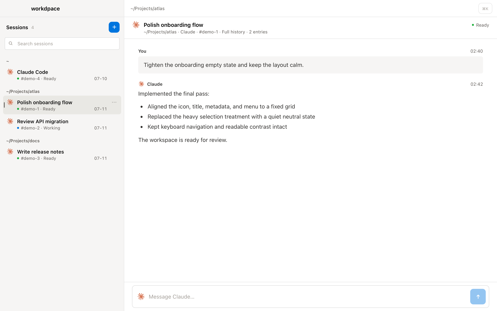

# workdpace

A calm, native macOS workspace for active Claude Code sessions running in tmux.



workdpace lets you search and switch sessions, read their conversation history, and send prompts without replacing your terminal workflow. It uses AppKit for the application shell and WKWebView for the interface—there is no Electron runtime.

> **Alpha:** Claude Code is the only working provider today. Codex support is planned, but it is not implemented.

## Features

- Finds active local Claude Code sessions running inside tmux.
- Groups and searches sessions by project.
- Reads visible user and assistant messages from Claude Code's local JSONL transcripts.
- Falls back to the complete tmux scrollback when a structured transcript is unavailable.
- Sends prompts to the exact tmux pane from the desktop composer.
- Creates sessions and deletes them with confirmation.
- Supports `⌘K` to search, `⌘N` to create, and `⌘R` to refresh.

“Full history” means the complete visible conversation text available to the app. Tool-only events, internal metadata, and hidden reasoning are intentionally not rendered.

## Requirements

- macOS 13 or newer
- Xcode Command Line Tools (`xcode-select --install`)
- tmux
- Claude Code, installed and authenticated through Claude Code itself

workdpace is standalone and does not require or modify the `work` CLI from its original development environment.

## Build and install

```bash
./build.sh
```

This compiles the native app for the current Mac, signs it ad hoc, and installs it at `~/Applications/workdpace.app`.

To build an isolated copy without installing it:

```bash
./build.sh --check
```

The command prints the temporary app path.

## Run

```bash
open "$HOME/Applications/workdpace.app"
```

To open workdpace with a particular project as its starting directory:

```bash
open -na "$HOME/Applications/workdpace.app" --args "$PWD"
```

Claude Code remains responsible for authentication and for any network requests made while processing prompts.

## Test

```bash
bash Tests/sesslist.bash
bash Tests/app.bash
```

The app test builds an isolated bundle and exercises the session bridge, transcript parser, message transport, and UI contract.

## Privacy and safety

workdpace has no telemetry and does not operate a remote service. Its WebView uses a non-persistent data store and communicates with the native process through an in-process URL scheme rather than a local HTTP server.

To provide session history, the app reads local tmux state and Claude Code metadata and transcripts under `~/.claude`. It does not upload those files, persist a second transcript copy, access the Keychain, or read or change Claude credentials. See [SECURITY.md](SECURITY.md) for reporting security issues.

Deleting a session runs the equivalent of `tmux kill-session` after confirmation. This stops the entire tmux session; it does not delete the project or Claude transcript files.

## Current limitations

- Only active local Claude Code sessions in tmux are supported.
- Ended or archived sessions are not browsable.
- Codex has a planned provider boundary but no working backend.
- This is a conversation workspace, not a terminal emulator.
- Messages are limited to 32 KB.
- The Claude transcript format is not controlled by this project and may change.
- Releases are ad-hoc signed and are not notarized by Apple.

## Contributing

Contributions are welcome. Read [CONTRIBUTING.md](CONTRIBUTING.md) before opening a pull request.

## License and trademarks

The original project code is available under the [MIT License](LICENSE). Third-party names, trademarks, and provider icons are not granted under that license; see [NOTICE](NOTICE).

workdpace is an independent community project. It is not affiliated with, endorsed by, or sponsored by Anthropic, OpenAI, or Notion.
